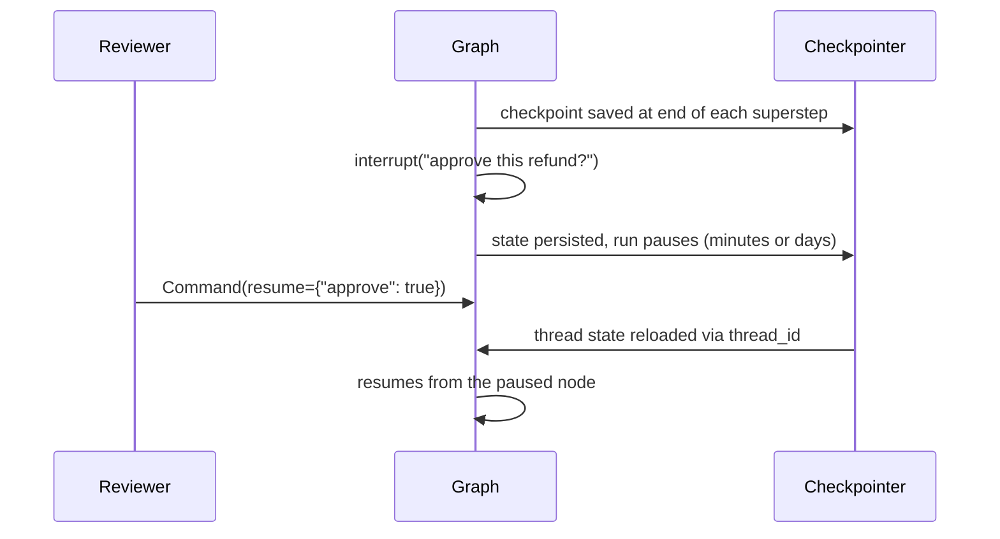

# Use cases: where checkpoints and stores actually earn their keep

The [main README](README.md) shows *how* LangGraph checkpoints and stores
behave. This document answers the next question people ask: **"when would I
actually need this?"** — with use cases drawn from the official LangGraph
documentation, LangChain's published case studies, conference talks, and
practitioner production writeups.

> **How this was researched.** Every claim below was checked against live
> primary sources on 2026-07-09 (official docs, LangChain blog, vendor
> announcements, recorded talks), with the docs-canonical claims verified
> verbatim. Enterprise numbers are vendor- or self-reported and unaudited;
> where a claim is an inference rather than a documented fact, it is labeled
> as such. Sources are linked inline and listed at the end.

## The one-table summary

| You need to... | Reach for | Why |
|---|---|---|
| Continue a conversation across turns | **Checkpointer** | State snapshots per `thread_id` |
| Pause for human approval, resume later | **Checkpointer** | `interrupt()` requires a checkpointer |
| Survive a crash mid-run | **Checkpointer** | Resume from the last successful super-step |
| Replay or fork a past run to debug | **Checkpointer** | Time travel reads checkpoint history |
| Remember user preferences next week | **Store** | Namespaced key-value data, cross-thread |
| Share knowledge between agents/graphs | **Store** | Store crosses graph and thread boundaries |
| Recall memories by meaning, not key | **Store** | Semantic search over store items |
| Ship a production agent | **Both** | `compile(checkpointer=..., store=...)` |

The official persistence docs put it in one line: *"Most applications can use
both: a checkpointer tracks the current thread, and a store tracks durable
information across threads."*
([docs](https://docs.langchain.com/oss/python/langgraph/persistence))

---

## Checkpoint-powered use cases

The docs name exactly four canonical checkpoint patterns: **conversation
continuity, human-in-the-loop workflows, time travel, and fault tolerance**
([persistence docs](https://docs.langchain.com/oss/python/langgraph/persistence)).

### 1. Multi-turn conversation continuity

The pattern this repo's [checkpoint demo](src/checkpoints_vs_stores/checkpoint_demo.py)
shows: a chatbot that remembers earlier turns because each invoke on the same
`thread_id` resumes the saved thread state. Every chat product needs this;
without a checkpointer, each request starts from a blank state.

### 2. Human-in-the-loop approvals — the flagship enterprise pattern

`interrupt()` pauses a graph mid-run and waits — *indefinitely* — for a
human decision. This is strictly checkpoint-dependent: the docs state you
need (1) a checkpointer to persist graph state and (2) a `thread_id` so the
runtime knows which state to resume
([interrupts docs](https://docs.langchain.com/oss/python/langgraph/interrupts)).

The docs enumerate the canonical uses: **approval before critical actions**
(API calls, database changes, financial transactions), **reviewing/editing
LLM outputs or state**, **reviewing tool calls before execution**, and
**validating human input**.

Two production notes straight from the docs:

- Use a *durable* checkpointer in production (`InMemorySaver` forgets the
  paused state on restart — the approval would be lost).
- On resume, the interrupted node **re-executes from its start**, so any side
  effects before the `interrupt()` call should be idempotent.

### 3. Fault tolerance / durable execution

LangGraph writes a checkpoint at the end of every superstep. If a node fails,
the graph restarts from the last successful step, and pending writes from the
failed superstep are preserved so successful nodes don't re-run
([persistence docs](https://docs.langchain.com/oss/python/langgraph/persistence)).
For long-running agents — the kind that work autonomously for many minutes —
this is the difference between "retry the whole run" and "resume where it
died". (The old `durable-execution` docs URL now redirects into the
consolidated persistence page; same capability, one page.)

### 4. Time travel: replay and fork

Because checkpoint history is kept per thread, you can **replay** a past
execution to debug it, or **fork** from a prior checkpoint with modified
state to explore an alternative path
([time-travel docs](https://docs.langchain.com/oss/python/langgraph/use-time-travel)).
Nodes *before* the chosen checkpoint are not re-executed (results are already
saved); nodes *after* it **do re-execute, including LLM calls** — replay is a
resume, not a cache read.

---

## Store-powered use cases

The docs' one-liner: *"Stores persist application-defined data outside the
graph state. Use them for long-term, cross-thread memory, including user
preferences, facts, and shared knowledge."*
([persistence docs](https://docs.langchain.com/oss/python/langgraph/persistence))

### 5. User preferences and profiles across sessions

The pattern this repo's [store demo](src/checkpoints_vs_stores/store_demo.py)
shows: "remember my favorite language" on Monday, recall it in a brand-new
conversation on Friday, keyed by a `(user_id, "profile")` namespace. This is
the canonical personalization memory —
[LangChain's long-term-memory docs](https://docs.langchain.com/oss/python/langchain/long-term-memory)
describe store items as JSON documents organized by namespace (folder-like,
usually containing user/org IDs) and key (file-like).

### 6. Shared knowledge across threads, graphs, and agents

Two documented reasons the Store — not the checkpointer — is the sharing
mechanism:

- **Across threads**: checkpoints are locked to one `thread_id` lineage;
  store namespaces are whatever you design (per user, per org, per app).
- **Across graph boundaries**: each subgraph manages its own checkpoint
  namespace, so LangChain's guidance for data that must cross graph
  boundaries is to put it in the Store
  ([support article](https://support.langchain.com/articles/6253531756-understanding-checkpointers-databases-api-memory-and-ttl)).
  Multi-agent systems sharing facts between specialist agents is the natural
  application of this.

Related sizing guidance from the same article: keep large objects (images,
PDFs, documents) in the Store and reference them by ID instead of embedding
them in graph state — otherwise every superstep checkpoints the payload.

### 7. Semantic memory search

Since December 2024, `BaseStore` supports semantic search: configure an
embedding function (`index={"embed": ..., "dims": ...}`) and
`store.search(namespace, query="...")` ranks items by meaning instead of
exact key match
([announcement](https://blog.langchain.com/semantic-search-for-langgraph-memory/)).
It shipped in the open-source `PostgresStore` and `InMemoryStore` and is
backwards-compatible with existing stores. LangChain positions it around
three memory use cases: recalling preferences/past interactions for
personalization, retrieving similar past mistakes to avoid repeating them,
and keeping knowledge consistent across interactions.

### 8. Structuring memories: LangChain's memory taxonomy

[LangChain's LangMem guide](https://langchain-ai.github.io/langmem/concepts/conceptual_guide/)
— built on the same `BaseStore` primitive — organizes long-term memory into
three types, each a store-backed pattern:

| Memory type | Holds | Typical shape |
|---|---|---|
| **Semantic** | Facts and knowledge ("Ada prefers Python") | Profile (one doc per user) or collection |
| **Episodic** | Past experiences kept as few-shot examples of what worked | Collection |
| **Procedural** | Learned system behavior / evolving instructions | Prompt rules or collection |

The same guide's production tip: form memories on the **hot path** (during
the conversation) when you need immediate updates, or in the **background**
(after the conversation) when you can't afford the added response latency.

---

## Who runs this in production

LangChain's [case-studies index](https://docs.langchain.com/oss/python/langgraph/case-studies)
lists 40+ companies using LangGraph in production — LinkedIn, Uber, Replit,
Elastic, Klarna, J.P. Morgan, BlackRock, GitLab, Rakuten, Vodafone, Cisco,
and more. An honesty note this document insists on: **those aggregate pages
don't say which persistence feature each company uses** — we verified that
none of them mention checkpointers or stores by name. The per-company detail
below comes from individual talks and writeups.

- **Replit** — the strongest documented checkpoint-shaped story. Its
  production software-building copilot is a LangGraph multi-agent system
  with human-in-the-loop capabilities (users observe and control package
  installs, file creation)
  ([LangChain blog](https://blog.langchain.com/is-langgraph-used-in-production/),
  [case study](https://www.langchain.com/breakoutagents/replit)). Since
  interrupts require a checkpointer, this *implies* checkpointer use — an
  inference; no source states it directly. In the
  [Interrupt 2025 fireside chat](https://interrupt.langchain.com/videos/building-replit-agent),
  Replit's president described Agent V2 running autonomously for 10–15
  minutes per run (target: one hour) at a scale of roughly one million
  applications created per month — exactly the long-running-agent profile
  that durable execution exists for.
- **Klarna** — customer-support assistant serving ~85M users, built on
  LangGraph for request routing and task orchestration; Klarna attributed
  lower latency and cost to it
  ([case study, Feb 2025](https://www.langchain.com/blog/customers-klarna)).
  Worth knowing: in May 2025 Klarna publicly shifted back to a hybrid model
  with human agents after over-rotating on AI-only support.
- **Uber, LinkedIn, J.P. Morgan, BlackRock** — each presented production
  LangGraph agents at Interrupt 2025 (developer tooling saving a reported
  21,000 developer hours; a hiring agent; investment research; asset
  management). See the
  [Interrupt 2025 playlist](https://www.youtube.com/playlist?list=PLfaIDFEXuae3LIv3FbwVmqxw-s_WqP8iy).
- **Tiendanube** (LatAm e-commerce) — the best public *nuts-and-bolts*
  checkpoint writeup we found: a multi-agent support copilot on the
  **Postgres checkpointer** handling 120,000+ conversations/week, adopted
  specifically for human-in-the-loop and time travel
  ([practitioner writeup](https://tadeodonegana.com/posts/scaling-langgraph-postgres-checkpointer/)).
  Their production lessons preview everything Chapter 2 of this repo is
  about: an average conversation generated ~93 rows across the four
  checkpoint tables, so they added a TTL cleanup job, partitioned tables by
  `thread_id`, archive old threads to S3 — and compile the checkpointer
  **only into the supervisor graph**, keeping specialist subgraphs
  stateless.

---

## Which backends people use in production

The demos in this repo use `InMemorySaver`/`InMemoryStore` so everything runs
offline — production replaces them, same interface:

| Backend | Checkpointer | Store | Documented position |
|---|---|---|---|
| Postgres | `PostgresSaver` | `PostgresStore` | The docs' production recommendation; LangGraph Platform stores checkpoints in Postgres, always |
| SQLite | `SqliteSaver` | — | "Local file-based storage for development" |
| Redis | `RedisSaver` (+ `ShallowRedisSaver`) | `RedisStore` | Official Redis-maintained integration; native TTLs, vector search; shallow savers keep only the latest checkpoint (cheaper, no time travel) |
| MongoDB | `MongoDBSaver` | `MongoDBStore` | Official integration; 16 MB document limit — LangChain suggests Postgres when checkpoints outgrow it |

Operational facts worth planning around (from LangChain's
[support docs](https://support.langchain.com/articles/6253531756-understanding-checkpointers-databases-api-memory-and-ttl)
and the Tiendanube writeup): a checkpoint is written at the end of *every
superstep*, checkpoint tables grow unboundedly without a TTL or cleanup
policy, and TTLs are not retroactive — they only apply to checkpoints created
after being enabled.

---

## Mapping back to this repo

| Use case above | Runnable proof here |
|---|---|
| Conversation continuity (1) | [`checkpoint_demo.py`](src/checkpoints_vs_stores/checkpoint_demo.py), [`examples/01_checkpointer_minimal.py`](examples/01_checkpointer_minimal.py) |
| Preferences across sessions (5) | [`store_demo.py`](src/checkpoints_vs_stores/store_demo.py), [`examples/02_store_minimal.py`](examples/02_store_minimal.py) |
| Both layers in one agent (8 + 1) | [`combined_demo.py`](src/checkpoints_vs_stores/combined_demo.py), [`examples/03_both_minimal.py`](examples/03_both_minimal.py) |
| HITL, time travel, semantic search, real backends | Planned: Chapter 2 |

## Watch / read next

- [Interrupt 2025 conference playlist](https://www.youtube.com/playlist?list=PLfaIDFEXuae3LIv3FbwVmqxw-s_WqP8iy) — LangChain's official channel; production talks by Uber, LinkedIn, J.P. Morgan, BlackRock, Cisco, 11x, Replit
- [Building Replit Agent V2](https://interrupt.langchain.com/videos/building-replit-agent) — fireside chat on long-running autonomous agents with human-in-the-loop
- [Launching long-term memory support in LangGraph](https://www.langchain.com/blog/launching-long-term-memory-support-in-langgraph) — why the Store is a low-level primitive, not a fixed memory scheme
- [Semantic search for LangGraph memory](https://blog.langchain.com/semantic-search-for-langgraph-memory/) — the embeddings-based store search launch
- [LangMem conceptual guide](https://langchain-ai.github.io/langmem/concepts/conceptual_guide/) — the semantic/episodic/procedural taxonomy in depth
- [Scaling the LangGraph Postgres checkpointer](https://tadeodonegana.com/posts/scaling-langgraph-postgres-checkpointer/) — Tiendanube's production numbers and cleanup architecture
- [Persistence](https://docs.langchain.com/oss/python/langgraph/persistence) · [Interrupts](https://docs.langchain.com/oss/python/langgraph/interrupts) · [Time travel](https://docs.langchain.com/oss/python/langgraph/use-time-travel) · [Long-term memory](https://docs.langchain.com/oss/python/langchain/long-term-memory) — the primary docs behind every pattern above
