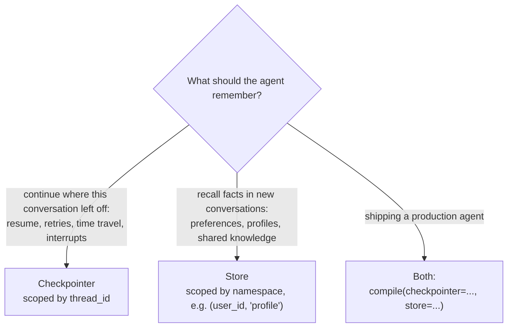
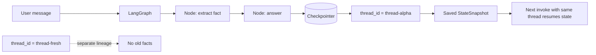
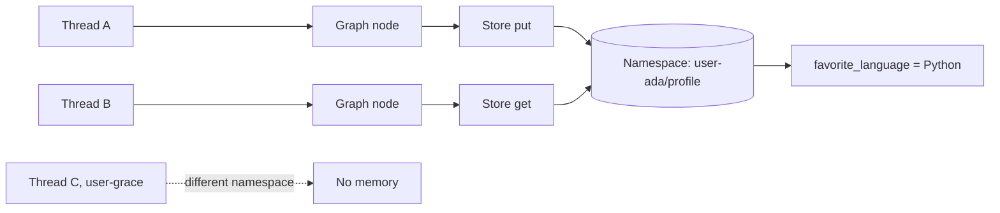
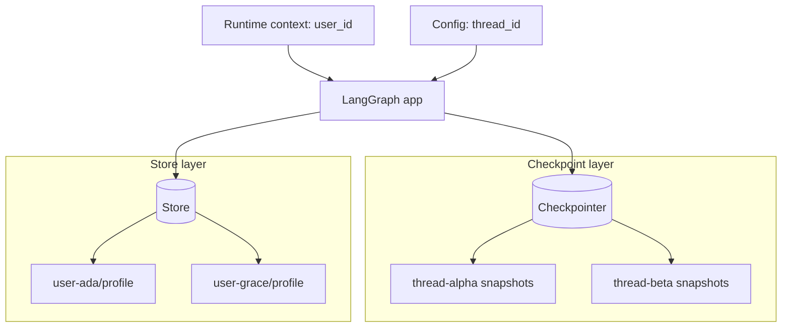

# LangGraph Checkpoints vs Stores

[](https://www.python.org/)
[](https://pypi.org/project/langgraph/)
[](LICENSE)
[](https://github.com/astral-sh/ruff)
[](tests/)


> [!TIP]
> Wondering **when you'd actually use checkpoints or stores**? Read
> [README-USECASES-EXAMPLE.md](README-USECASES-EXAMPLE.md) — a
> source-verified guide mapping real-world scenarios (human-in-the-loop
> approvals, crash recovery, semantic memory) and production case studies
> (Replit, Klarna, Uber, LinkedIn) to the right persistence mechanism.

Runnable, deterministic examples that show the difference between LangGraph
**checkpoints** (thread-scoped graph state) and **stores** (cross-thread,
long-term memory), using real `StateGraph`, `InMemorySaver`, and
`InMemoryStore` code, with tests and CI.

No LLM calls and no API keys: everything runs offline. Every output quoted
below is captured from a real run by
[`scripts/generate_artifacts.py`](scripts/generate_artifacts.py), with only
volatile values (checkpoint ids, timestamps) redacted.

## The difference in one screen

| Question | Checkpoints | Stores |
|---|---|---|
| What is saved? | Graph state snapshots | Application-defined key-value data |
| Scope | One `thread_id` | Cross-thread namespace, e.g. `(user_id, "profile")` |
| Who writes it? | LangGraph runtime, via the checkpointer | Your graph nodes / app code |
| Best for | Resume, chat continuity, time travel, interrupts, fault tolerance | User facts, preferences, memories, shared knowledge |

```text
thread_id ──▶ checkpointer ──▶ "Where is this graph thread right now?"
user_id   ──▶ store        ──▶ "What durable facts do we know about this user?"
```

Use **checkpoints** to save where this graph thread is. Use **stores** to save
durable memory outside the thread.

## Which one do I need?



The same decision tree is printed at the end of `demo all`. For the
real-world scenarios behind each branch — human-in-the-loop approvals, crash
recovery, semantic memory, and who runs this in production — see
[README-USECASES-EXAMPLE.md](README-USECASES-EXAMPLE.md).

## Quickstart

One command — creates `.venv`, installs, lints, tests, and runs every demo:

```bash
./setup_and_run.sh
```

Or step by step:

```bash
python -m venv .venv
source .venv/bin/activate
python -m pip install -e ".[dev]"

python -m checkpoints_vs_stores.demo all   # or: lg-memory-demo all
pytest
```

`demo all` renders a small terminal dashboard: the checkpoint and store demos
side by side (stacked on narrow terminals), the combined demo below, and the
decision tree last. Use `--plain` for flat text or `--json` for
machine-readable output.

Or with the Makefile: `make install`, `make demo`, `make test`,
`make artifacts`.

## Demo 1: checkpoints are scoped to a thread

```bash
python -m checkpoints_vs_stores.demo checkpoint
```

Output (from
[`artifacts/sample-output/checkpoint_demo.txt`](artifacts/sample-output/checkpoint_demo.txt)):

```text
thread-alpha / invoke #1:
  Checkpoint now has 1 durable-in-thread fact(s).

thread-alpha / invoke #2:
  Your name is Ada. I know because this thread has a checkpoint.

thread-fresh / invoke #1:
  I don't know your name in this thread.
```

The second invoke on `thread-alpha` recalls Ada from checkpointed thread
state. `thread-fresh` knows nothing, because it is a separate checkpoint
lineage.



Code: [`src/checkpoints_vs_stores/checkpoint_demo.py`](src/checkpoints_vs_stores/checkpoint_demo.py)

## Demo 2: stores share memory across threads

```bash
python -m checkpoints_vs_stores.demo store
```

Output (from
[`artifacts/sample-output/store_demo.txt`](artifacts/sample-output/store_demo.txt)):

```text
thread-a / user-ada:
  Stored long-term memory: favorite_language=Python for user_id=user-ada.

thread-b / user-ada:
  Your favorite language is Python. I found that in the Store, not this thread.

thread-c / user-grace:
  I don't have a favorite language for this user in the Store.
```

`thread-b` is a brand-new thread, yet it recalls Python because the store
namespace `(user-ada, "profile")` is shared across threads. `user-grace` has a
different namespace, so she gets nothing.



Code: [`src/checkpoints_vs_stores/store_demo.py`](src/checkpoints_vs_stores/store_demo.py)

## Demo 3: both layers together

```bash
python -m checkpoints_vs_stores.demo both
```

The combined demo compiles one graph with both `checkpointer=...` and
`store=...`, the way production agents usually run, and shows that:

- checkpointed state stays separate per thread, and
- store memory is shared by namespace.

Full output:
[`artifacts/sample-output/combined_demo.txt`](artifacts/sample-output/combined_demo.txt).
Code: [`src/checkpoints_vs_stores/combined_demo.py`](src/checkpoints_vs_stores/combined_demo.py)



## Use it in your own code

The demo modules carry demo scaffolding (result dicts, formatters), so
[`examples/`](examples/) contains the same patterns as minimal standalone
scripts you can copy straight into a project:

| Recipe | The whole trick |
|---|---|
| [`01_checkpointer_minimal.py`](examples/01_checkpointer_minimal.py) | `compile(checkpointer=...)`, then pass `{"configurable": {"thread_id": ...}}` on invoke |
| [`02_store_minimal.py`](examples/02_store_minimal.py) | `compile(store=...)`, then read/write `runtime.store` inside a node |
| [`03_both_minimal.py`](examples/03_both_minimal.py) | `compile(checkpointer=..., store=...)` — the production shape |

Each runs standalone (`python examples/01_checkpointer_minimal.py`), asserts
what it claims, and is executed by the test suite. The lines that matter:

```python
graph = builder.compile(checkpointer=InMemorySaver(), store=InMemoryStore())

config = {"configurable": {"thread_id": "thread-1"}}       # checkpoint scope
context = Context(user_id="user-ada")                      # store namespace scope
graph.invoke({"user_message": "hi"}, config, context=context)
```

Swap `InMemorySaver` / `InMemoryStore` for persistent backends in production —
see [`docs/production-notes.md`](docs/production-notes.md).

## Generated artifacts

`make artifacts` (or `python scripts/generate_artifacts.py`) reruns all three
demos and rewrites:

- [`artifacts/sample-output/`](artifacts/sample-output/) — the outputs quoted
  above
- [`artifacts/demo-summary.json`](artifacts/demo-summary.json) —
  machine-readable results
- [`artifacts/comparison-matrix.csv`](artifacts/comparison-matrix.csv) — the
  comparison table as data

Checkpoint ids and timestamps are redacted during generation, so the committed
files are byte-stable across reruns.

## Repo layout

```text
.
├── .gitlab-ci.yml                       # Pipeline: lint + tests + artifact rendering
├── artifacts/                           # Generated demo evidence
├── diagrams/                            # Mermaid diagram sources
├── docs/                                # Concept notes, runbook, production notes
├── examples/                            # Minimal copy-paste recipes
├── scripts/generate_artifacts.py        # Rebuild text/JSON/CSV artifacts
├── src/checkpoints_vs_stores/           # The LangGraph demos
└── tests/                               # Pytest coverage for the behavior
```

## CI

The GitLab pipeline runs three jobs: `lint` (ruff check + format),
`unit_tests` (pytest), and `render_demo_artifacts` (reruns the demos and
uploads `artifacts/`).

## References

- Persistence overview: <https://docs.langchain.com/oss/python/langgraph/persistence>
- Checkpointers: <https://docs.langchain.com/oss/python/langgraph/checkpointers>
- Stores: <https://docs.langchain.com/oss/python/langgraph/stores>
- Memory guide: <https://docs.langchain.com/oss/python/langgraph/add-memory>
- PyPI package: <https://pypi.org/project/langgraph/>

## License

[Apache 2.0](LICENSE)
