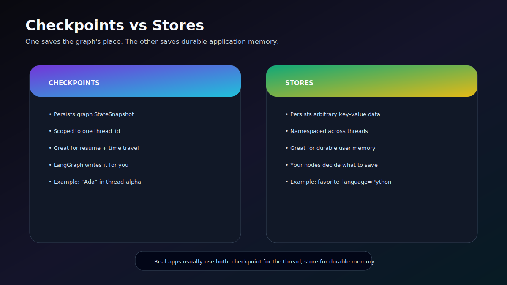
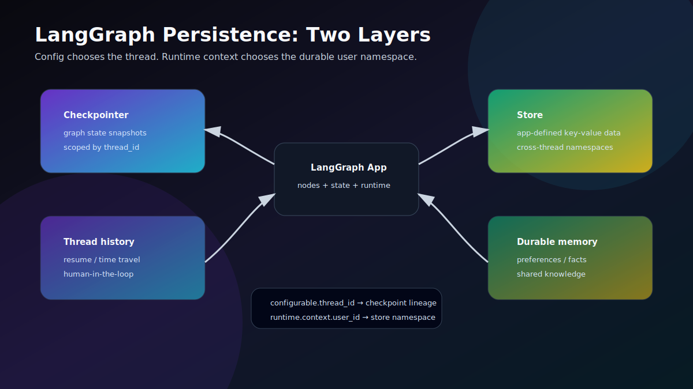
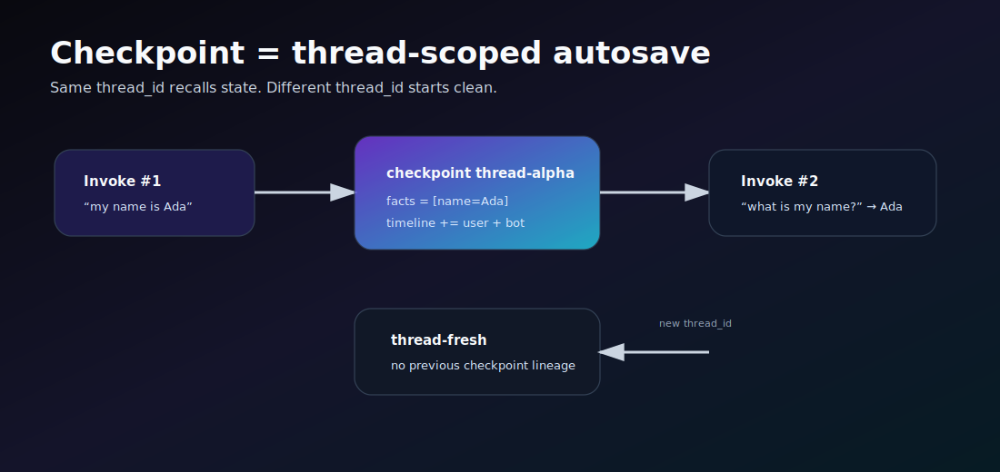
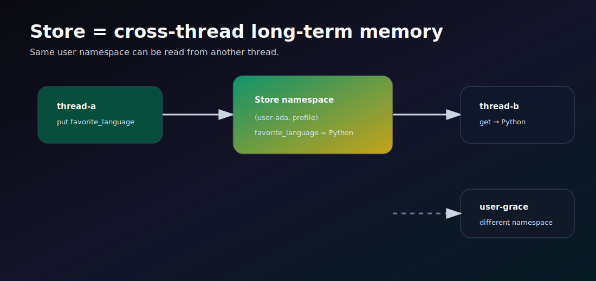
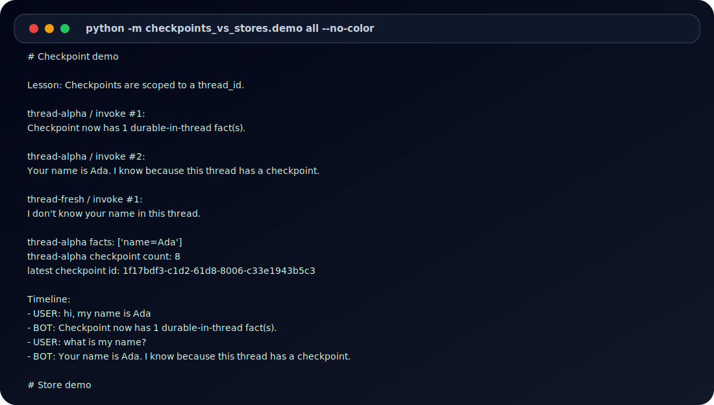

# ⚡ LangGraph Checkpoints vs Stores

<p align="center">
  
</p>

<p align="center">
  
  
  
  
</p>

A polished, runnable GitLab-ready repo that demonstrates the difference between LangGraph **checkpoints** and **stores** with real code, generated artifacts, diagrams, tests, and CI.

The demos are deterministic: **no LLM calls, no API keys, no cloud dependency**. They use real LangGraph primitives: `StateGraph`, `InMemorySaver`, `InMemoryStore`, `thread_id`, and runtime store access.

---

## The difference in one screen

| Question | Checkpoints | Stores |
|---|---|---|
| What is saved? | Graph state snapshots | Application-defined key-value data |
| Scope | One `thread_id` | Cross-thread namespace, for example `(user_id, "profile")` |
| Who writes it? | LangGraph runtime via the checkpointer | Your graph nodes / app code |
| Best for | Resume, chat continuity, time travel, interrupts, fault tolerance | User facts, preferences, memories, shared knowledge |
| Demo proof | `thread-alpha` remembers Ada; `thread-fresh` does not | `thread-b` recalls Python for `user-ada`; `user-grace` does not |

> Rule: use **checkpoints** to save where this graph thread is. Use **stores** to save durable memory outside the thread.

---

## Visual architecture

<p align="center">
  
</p>

<table>
<tr>
<td width="50%"></td>
<td width="50%"></td>
</tr>
</table>

---

## Quickstart

```bash
git clone <your-gitlab-url>/langgraph-checkpoints-vs-stores.git
cd langgraph-checkpoints-vs-stores

python -m venv .venv
source .venv/bin/activate
python -m pip install -e ".[dev]"

python -m checkpoints_vs_stores.demo all
pytest
```

Or use the Makefile:

```bash
make install
make demo
make test
make artifacts
```

---

## Run the demos

### 1. Checkpoint demo

```bash
python -m checkpoints_vs_stores.demo checkpoint
```

What it proves:

- Invoke #1 on `thread-alpha`: user says `my name is Ada`.
- Invoke #2 on the same `thread_id`: the graph recalls Ada from checkpointed thread state.
- Invoke #1 on `thread-fresh`: the graph does not know Ada because it is a different checkpoint lineage.

Code: [`src/checkpoints_vs_stores/checkpoint_demo.py`](src/checkpoints_vs_stores/checkpoint_demo.py)

### 2. Store demo

```bash
python -m checkpoints_vs_stores.demo store
```

What it proves:

- `thread-a`, `user-ada`: stores `favorite_language=Python`.
- `thread-b`, same `user_id`: recalls Python from the store, even though it is a new thread.
- `thread-c`, `user-grace`: cannot recall Python because it is a different namespace.

Code: [`src/checkpoints_vs_stores/store_demo.py`](src/checkpoints_vs_stores/store_demo.py)

### 3. Combined demo

```bash
python -m checkpoints_vs_stores.demo both
```

What it proves:

- Checkpointed state remains separate per thread.
- Store memory is shared by namespace.
- Real agent apps often compile with both `checkpointer=...` and `store=...`.

Code: [`src/checkpoints_vs_stores/combined_demo.py`](src/checkpoints_vs_stores/combined_demo.py)

---

## Example terminal artifact

<p align="center">
  
</p>

Generated files live in [`artifacts/`](artifacts/):

- [`artifacts/sample-output/checkpoint_demo.txt`](artifacts/sample-output/checkpoint_demo.txt)
- [`artifacts/sample-output/store_demo.txt`](artifacts/sample-output/store_demo.txt)
- [`artifacts/sample-output/combined_demo.txt`](artifacts/sample-output/combined_demo.txt)
- [`artifacts/comparison-matrix.csv`](artifacts/comparison-matrix.csv)
- [`artifacts/demo-summary.json`](artifacts/demo-summary.json)

Regenerate them with:

```bash
python scripts/generate_artifacts.py
```

---

## Repo layout

```text
.
├── .gitlab-ci.yml                       # GitLab pipeline: tests + artifact rendering
├── artifacts/                           # Generated demo evidence
├── diagrams/                            # Mermaid source diagrams
├── docs/                                # Concept notes, runbook, production notes
│   └── assets/                          # SVG diagrams/posters
├── scripts/generate_artifacts.py        # Rebuild text/JSON/CSV/SVG artifacts
├── src/checkpoints_vs_stores/           # Real LangGraph demos
└── tests/                               # Pytest coverage for the behavior
```

---

## GitLab pipeline

The included `.gitlab-ci.yml` has two stages:

1. `unit_tests`: install the package and run `pytest`.
2. `render_demo_artifacts`: regenerate artifacts and upload `artifacts/` + `docs/assets/` as GitLab job artifacts.

Push it like this:

```bash
git remote add origin git@gitlab.com:<namespace>/langgraph-checkpoints-vs-stores.git
git push -u origin main
```

---

## Source references

This repo targets the current LangGraph persistence model documented by LangChain:

- Persistence overview: <https://docs.langchain.com/oss/python/langgraph/persistence>
- Checkpointers: <https://docs.langchain.com/oss/python/langgraph/checkpointers>
- Stores: <https://docs.langchain.com/oss/python/langgraph/stores>
- Memory guide: <https://docs.langchain.com/oss/python/langgraph/add-memory>
- PyPI package: <https://pypi.org/project/langgraph/>

---

## Tiny mental model

```text
thread_id ──▶ checkpointer ──▶ "Where is this graph thread right now?"
user_id   ──▶ store        ──▶ "What durable facts do we know about this user?"
```

That is the whole repo.
